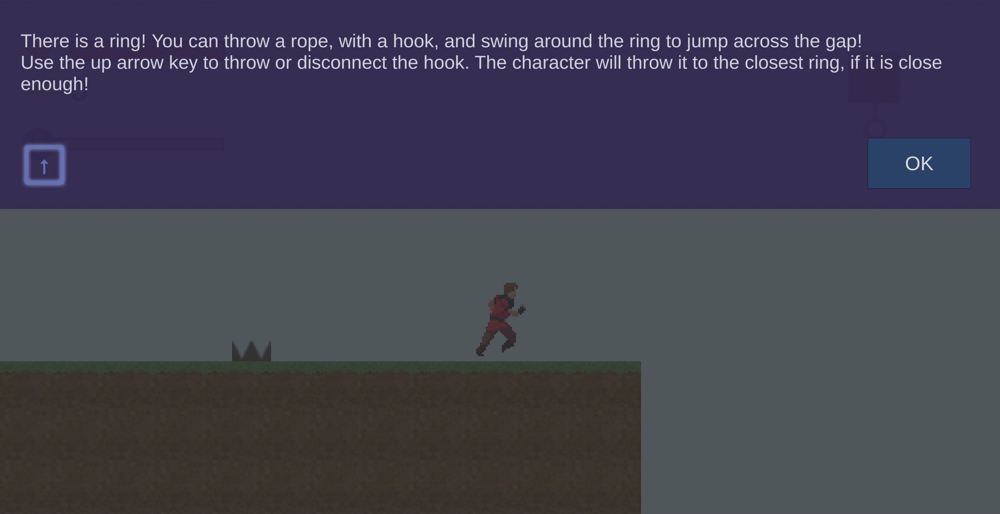
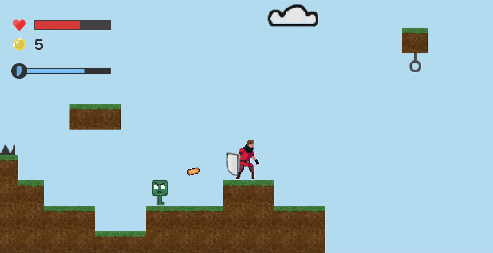
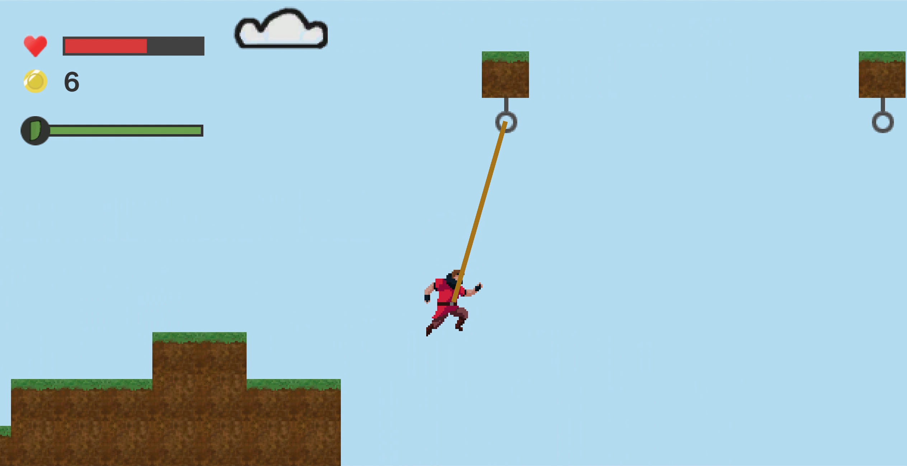
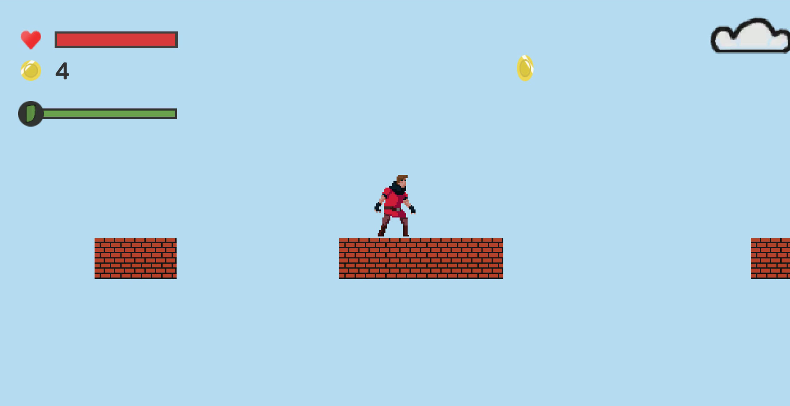
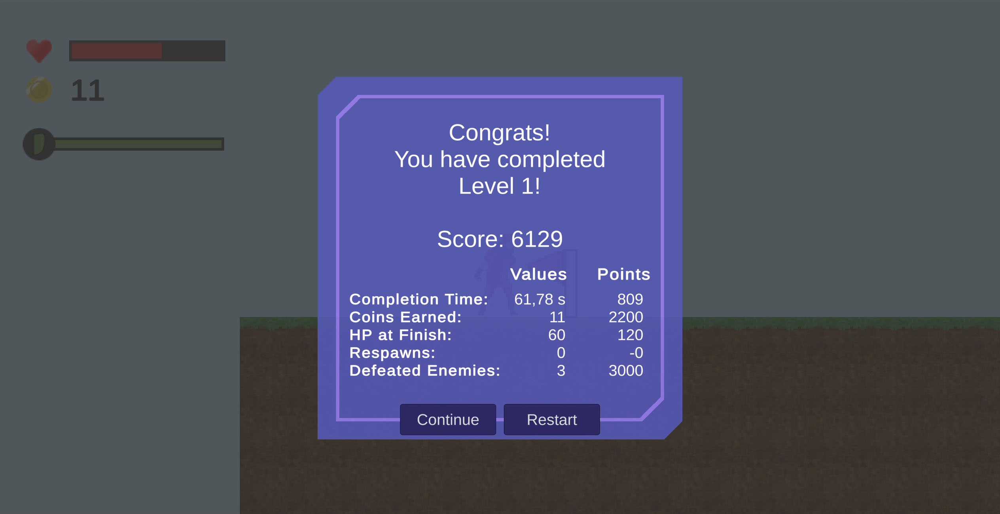

# Arcane Sky Adventure
## Introduction
It is a 2D platformer game developed with Unity Game Engine.

## Game Elements

### Tutorial
A tutorial to help the player learn how to play and discover the game world.

### Enemy and Shield
The game world is inhabited by some strange creatures, enemies. The character can use a shield to protect himself and defeat the enemies.

### Grappling Hooks
There are some rings that the character can throw hooks to jump across the gaps.

### Moving Platforms
There are platforms moving back and forth in a certain range.

### Score
At the end of each level, the player's performance is evaluated by calculating a score based on some criteria. Each criterion is also listed to enable the player to see their contribution to the overall score.

